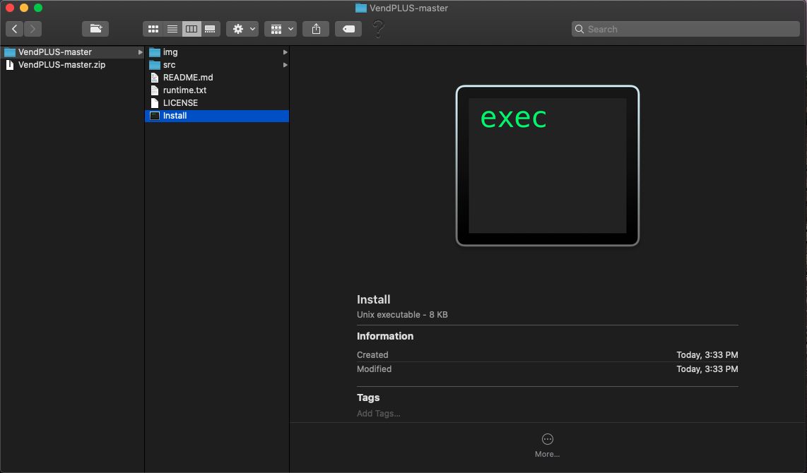
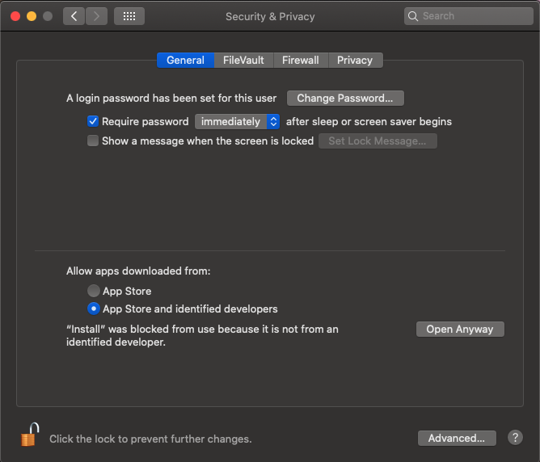

# VendPLUS&middot; [](https://snyk.io/test/github/AnthonyKenny98/Vend_Inventory_Upload?targetFile=src/requirements.txt) [](https://travis-ci.org/AnthonyKenny98/Vend_Inventory_Upload) [](https://github.com/AnthonyKenny98/Vend_Inventory_Upload/blob/master/LICENSE)
> Locally Hosted Web Application for easy CSV upload of inventory numbers for the POS and Inventory Management Software "Vend"

This README is intended to give an overview of this project and how to install and run the application. Help for how to use the application can be found on the initial loading page.


## Table of Contents

+ [Installation/Setup](#setup)
  + [Easy Install](#easy)
  + [Prerequisites](#prereq)
  + [Built With](#builtwith)
+ [Versioning](#version)
+ [Configuration](#config)
+ [Tests](#tests)
+ [Style Guide](#style)
+ [API Reference](#api)
+ [Licensing](#license)

## <a name="setup"></a>Installation/Setup

### <a name="easy"></a>Easy Install

1. Satisfy all the [prerequisites](#prereq).
2. Download the zip file of the program [here](https://github.com/AnthonyKenny98/Vend_Inventory_Upload/archive/master.zip), [uncompress](https://support.apple.com/en-au/guide/mac-help/mchlp2528/mac) the file, and move to your desired install location (Desktop is simple and easy).
3. Open the main folder "VendPLUS" and double click the "Install" file.

4. The installation may be blocked by your firewall. You can allow the installation by going to System Preferences > Security & Privacy.

5. Install will open a terminal window and run through the installation. Once it is complete, you can run the program by double clicking the "VendPLUS" file that has been generated in you Applications Folder, your Desktop, and the project folder.


### <a name="prereq"></a>Prerequisites
+ [Homebrew](https://brew.sh/#install): Homebrew is a package manager for MacOS and Linux. It is only important for downloading and installing Python 3.7.6. Homebrew can be installed by executing the following command in the Terminal:

  ```shell
  $ /usr/bin/ruby -e "$(curl -fsSL https://raw.githubusercontent.com/Homebrew/install/master/install)"
  ```
+ [Python 3.7.6](https://www.python.org/downloads/release/python-376/): Installed with Homebrew. You can check if you have the correct version by executing the following command in the Terminal:

  ```shell
  $ python3 --version
  Python 3.7.6
  ```
  
  If Python3 is not installed or out of date, you can install it by executing:
  ```shell
  $ brew install python
  ```

+ [pip3](https://pip.pypa.io/en/stable/): Installed with Homebrew

### <a name="builtwith"> </a>Built With
+ [Flask](http://flask.palletsprojects.com/en/1.1.x/): The app is a simple, locally hosted web application built with the Flask framework.
+ [Bootstrap](https://getbootstrap.com/): The UI of the app is built using the Bootstrap library. Acknowledgement to [BlackRock Digital](https://github.com/BlackrockDigital) for the [StartBootstrap Admin Template](https://github.com/BlackrockDigital/startbootstrap-sb-admin) template, which served as a foundation for this application's UI.
+ [Jinja2](https://jinja.palletsprojects.com/en/2.10.x/): The python application passes data to the bootstrap UI using the Jinja2 Library.

### <a name="devinstall"></a>Installation for Developers

  ```shell
  $ git clone 
  $ cd VendPLUS
  $ ./Install
  $ ./VendPLUS
  ```

## <a name="tests"></a>Tests

This project uses pytest for unit testing.

```shell
(venv) $ python3 -m pytest
```

## <a name="style"></a>Style Guide

This project uses the flake8 style guide for python. It can also be tested using pytest:

```shell
(venv) $ python3 -m pytest --flake8
```

## <a name="api"></a>Api Reference

+ [Vend POS API](https://docs.vendhq.com/)

## <a name="license"></a>Licensing

This project is licensed under the MIT License.  See the [LICENSE](LICENSE) file for more information.
